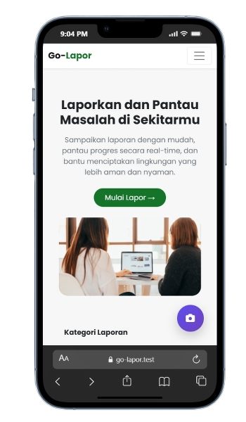
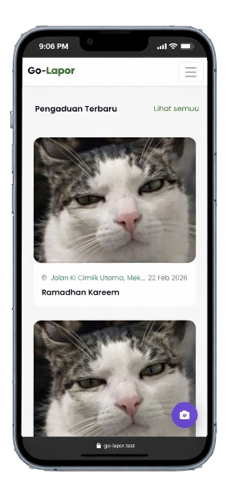
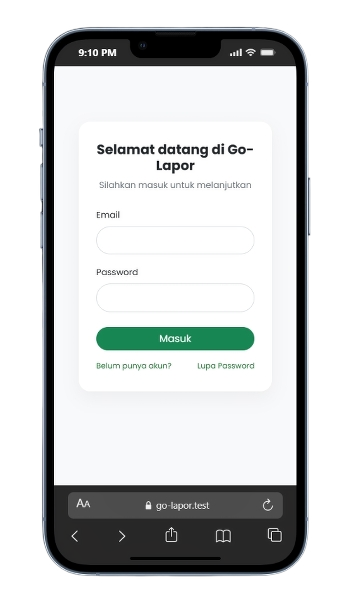
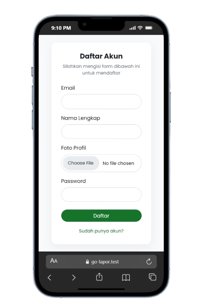
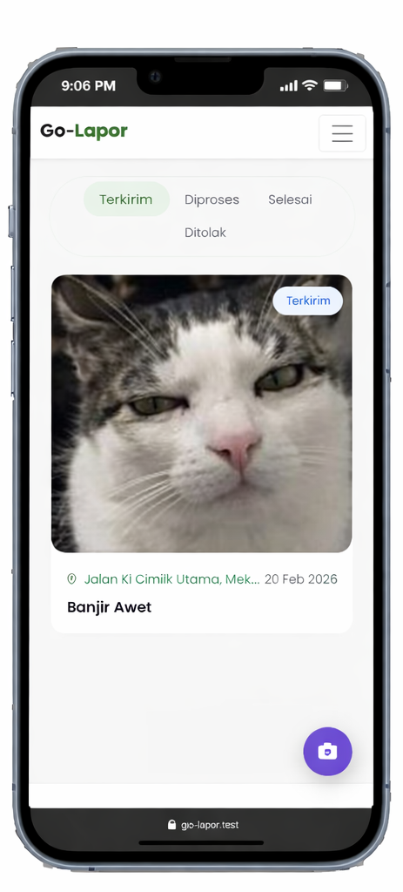
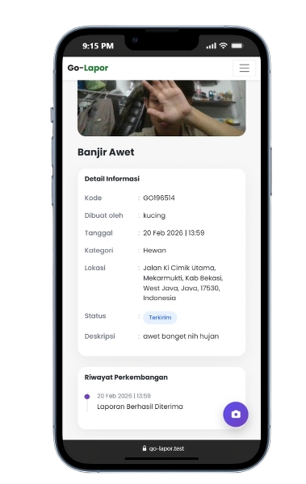
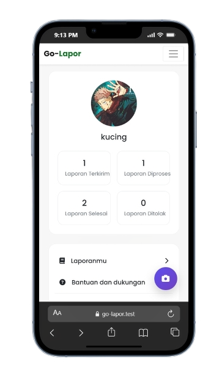

# 🟢 Go-Lapor

Go-Lapor is a web-based public complaint system built using Laravel, designed to allow users to report issues in their surroundings and track the progress of their reports in real-time.

The platform is designed to improve communication between the public and authorities by providing a simple, transparent, and structured reporting system.

---

## ✨ Highlights

- 📢 Submit public complaints بسهولة (easy reporting)
- 📍 Location-based report information
- 🖼 Upload images as report evidence
- 🔄 Track report status (Submitted, Processed, Completed, Rejected)
- 👤 User authentication & profile management
- 📱 Clean and mobile-friendly UI

---

## 📸 Preview

### 🏠 Landing Page

---

### 📋 Latest Reports

---

### 🔐 Authentication (Login & Register)

  
  

---

### 📂 My Reports & Status Tracking

---

### 📊 Report Detail

---

### 👤 User Profile

---

## 🚀 Features

### 📢 Submit Complaint

Users can create a report by providing:

- Title and description
- Category
- Location
- Image (as supporting evidence)

---

### 📍 Location-Based Reporting

Each complaint includes detailed location information to ensure accurate reporting.

---

### 🔄 Status Tracking

Users can track the progress of their reports through multiple stages:

- Submitted
- Processed
- Completed
- Rejected

---

### 📂 My Reports Management

Users can view all their submitted reports and monitor updates in one place.

---

### 📖 Report Detail

Each report provides complete information including:

- Report code
- Creator
- Date & time
- Status
- Description
- Progress history

---

### 👤 User Account System

- Register and login
- Profile management
- Personal report statistics

---

## 🛠 Tech Stack

- Laravel (Backend Framework)  
- Spatie Laravel Permission (Role & Access Control)  
- Tailwind CSS (UI Styling)  
